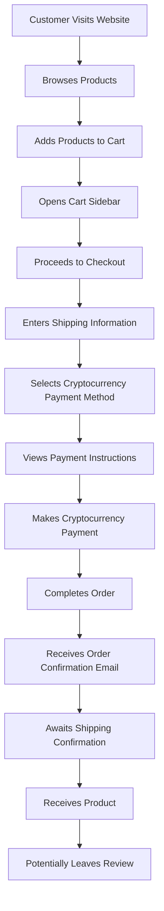
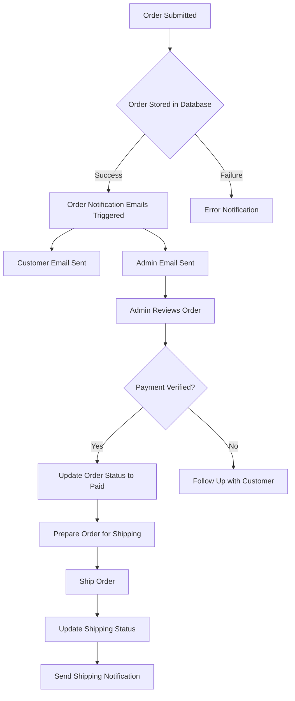
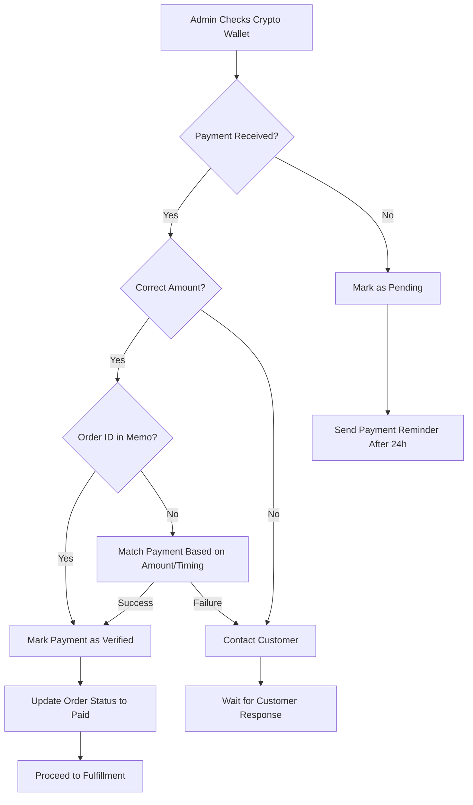

# Cleveland Cartridge Co - Order Process Flow

## Customer Order Journey

## Backend Order Processing

## Payment Verification Process

## Order Status Definitions

| Status | Description |
|--------|-------------|
| **pending** | Order created but payment not received |
| **paid** | Payment verified but not yet shipped |
| **processing** | Order is being prepared for shipment |
| **shipped** | Order has been shipped |
| **delivered** | Order has been delivered |
| **cancelled** | Order has been cancelled |

## Email Notification System

1. **Order Confirmation Email** (to Customer)
   - Order details
   - Payment instructions
   - Estimated processing time
   - Contact information

2. **New Order Notification** (to Admin)
   - Full order details
   - Customer information
   - Payment method information

3. **Payment Received Notification** (to Customer)
   - Confirmation of payment receipt
   - Next steps in the process
   - Estimated shipping date

4. **Shipping Notification** (to Customer)
   - Shipping confirmation
   - Tracking information (if available)
   - Estimated delivery date

## Customer Support Follow-up Points

- **24 hours after order**: If payment not received
- **After payment verification**: Confirmation and shipping timeline
- **After shipping**: Delivery status and tracking
- **7 days after delivery**: Request for review

## Key Performance Metrics

1. **Order Completion Rate**: % of cart checkouts that become completed orders
2. **Payment Success Rate**: % of orders that receive correct payment
3. **Processing Time**: Time between payment verification and shipping
4. **Customer Review Rate**: % of orders that result in reviews
5. **Average Order Value**: Total revenue / number of orders

## Database Security Architecture

1. **Row-Level Security Implementation**
   - PostgreSQL RLS policies prevent unauthorized access to customer data
   - Database queries are parameterized to prevent SQL injection attacks
   - Segregated permissions model with principle of least privilege

2. **Data Encryption**
   - All customer PII (Personally Identifiable Information) is encrypted at rest
   - Shipping addresses are stored with column-level encryption
   - TLS 1.3 secures all data in transit between services

3. **Data Access Controls**
   - Multi-factor authentication required for admin database access
   - Database access logs are maintained and audited regularly
   - IP-based access restrictions for backend systems

4. **Payment Data Isolation**
   - Cryptocurrency transaction hashes stored separately from customer data
   - No storing of private keys or seed phrases in the database
   - Zero correlation between payment identifiers and customer information without proper authorization

## Privacy Protection Measures

1. **Customer Data Protection**
   - Strict adherence to data minimization principles
   - Automated data retention policies to purge unnecessary information
   - No sharing of customer data with third parties

2. **Anonymized Analytics**
   - Usage metrics are collected without personally identifying information
   - Aggregated data used for business intelligence
   - Customers can opt out of non-essential data collection

3. **Technical Safeguards**
   - Regular penetration testing of systems
   - Automated vulnerability scanning
   - DDoS protection at network edge

## Recommended Improvements for Future

1. **Automated Payment Verification System**
   - Integrate with cryptocurrency APIs to automatically check payments
   - Alert admin only for exceptions

2. **Expanded Payment Options**
   - Add additional cryptocurrency options
   - Consider integrating payment processors

3. **Customer Account System**
   - Allow customers to create accounts
   - Enable order history viewing
   - Simplify reordering process

4. **Enhanced Post-Purchase Communication**
   - Automated email sequences
   - SMS notifications for important status changes
   - Personalized follow-ups based on purchase history

5. **Security Enhancements**
   - Implement zero-knowledge proofs for payment verification
   - Customer-side encryption keys for personal data
   - Decentralized identity verification options
